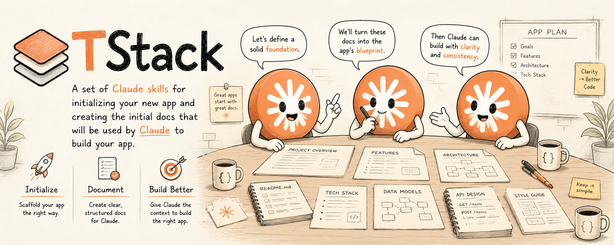
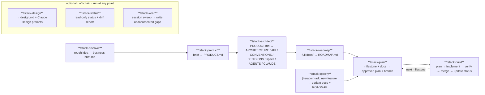

# TStack — a Claude Code Plugin

TStack is a Claude Code plugin that takes you from a rough product idea to a fully documented, milestone-sequenced, built project: **seven chained skills** (discover → product → architect → roadmap → plan → build, plus the specify iteration loop) and **three optional, off-chain companions** (`tstack-design`, `tstack-status`, and `tstack-wrap`) you can run at any point. Each chained stage auto-triggers based on what you say, reads its input artifact from disk, produces its output, and hands off to the next.

> Replaces a previous paste-the-guide-into-each-session workflow with a chain of skills that activate automatically and remember the state of your project on disk.

## The Lifecycle



Four skills form a one-time setup chain (`discover` → `product` → `architect` → `roadmap`). Then `tstack-plan` and `tstack-build` form the per-milestone loop you run repeatedly. `tstack-specify` is the iteration skill for adding features after launch — it hands into the same `plan` → `build` loop. `tstack-design`, `tstack-status`, and `tstack-wrap` sit **outside** the chain: invoke them whenever you need them — none is a required step and none blocks the flow. `tstack-wrap` is the natural way to close a session — it sweeps the work you just did for anything that should be in the docs but isn't, and writes the gaps.

## The Skills

**Chain (seven skills):**

| Skill | When it triggers | Input | Output |
|---|---|---|---|
| `tstack-discover` | "I want to build…", new product idea, no brief yet | rough description | `docs/1 - Discovery/business-brief.md` |
| `tstack-product` | "let's write the PRD" after discovery | business brief | `docs/PRODUCT.md` |
| `tstack-architect` | "design the architecture" after PRODUCT.md | PRODUCT.md | ARCHITECTURE / API / CONVENTIONS / TESTING / DECISIONS / specs + AGENTS.md + CLAUDE.md |
| `tstack-roadmap` | "make a roadmap" / "what do we build first" | full `docs/` tree | `docs/ROADMAP.md` |
| `tstack-plan` | "plan milestone Mx" / "what should we build next" | ROADMAP.md + milestone-referenced docs | approved implementation plan (`docs/plans/{id}.md`) + feature branch |
| `tstack-build` | "build it" / "ship this milestone" after a plan is approved | approved plan + feature branch | shipped milestone + merged branch + updated status |
| `tstack-specify` | "let's add feature X" in an established project | existing PRODUCT.md (+ ROADMAP.md) | updated docs + appended milestones |

**Optional companions (off-chain — run at any point):**

| Skill | When it triggers | Input | Output |
|---|---|---|---|
| `tstack-design` | "design the UI" / "create a design system" / "give me design prompts" | PRODUCT.md if present (else a description) + frontend stack | `docs/2 - Specs/design.md` + ready-to-paste Claude Design prompts |
| `tstack-status` | "where are we" / "project status" / "what's left" / "is anything out of sync" | `docs/` tree + git (read-only) | a chat status report incl. doc-drift flags |
| `tstack-wrap` | "before we wrap" / "did we miss documenting anything" / "sweep for doc gaps" / end of session | session work + `git log` + `docs/` tree | undocumented decisions/gotchas/events written to the right doc (no commit) + a chat report |

### Optional: auto-prompt `tstack-wrap` at session end

By default `tstack-wrap` is **manual** — you invoke it (`/tstack-wrap`, or by saying "before we wrap…"). That's deliberate: the highest-fidelity sweep needs the *live conversation*, where the session's decisions actually live, so it's best run in-session, on purpose.

If you want a guaranteed nudge when you're wrapping up, add an opt-in **`Stop` hook** to your project's `.claude/settings.json`. Note the constraints that make this the only workable pattern:

- `SessionEnd` **can't** do it — it fires *after* the model is done, so it can't run a skill or influence Claude (it's cleanup-only).
- `Stop` fires after **every** assistant turn, so it must (a) detect wrap-up intent and (b) guard against re-firing via `stop_hook_active`, or it will nag constantly.
- A headless/automated sweep (e.g. spawning `claude -p` from `SessionEnd`) would see only git + docs, **not** the chat — losing the part that matters most. So the goal of the hook is to *prompt you to run it interactively*, not to run it behind your back.

```jsonc
// .claude/settings.json
{
  "hooks": {
    "Stop": [
      { "matcher": "*", "hooks": [
        { "type": "command", "command": "${CLAUDE_PROJECT_DIR}/.claude/hooks/wrap-nudge.sh", "timeout": 5 }
      ] }
    ]
  }
}
```

```bash
#!/usr/bin/env bash
# .claude/hooks/wrap-nudge.sh — nudge tstack-wrap when you signal wrap-up. Needs jq.
input=$(cat)
# don't re-fire after we've already blocked once this turn (avoids a loop)
[ "$(jq -r '.stop_hook_active // false' <<<"$input")" = "true" ] && exit 0
transcript=$(jq -r '.transcript_path // ""' <<<"$input")
[ -f "$transcript" ] || exit 0
# last user message text (content may be a plain string or an array of blocks)
last=$(jq -rs '[.[] | select(.type=="user")] | last
  | (.message.content // .content)
  | if type=="array" then (map(.text? // empty) | join(" ")) else (. // "") end' "$transcript")
if echo "$last" | grep -iqE '(wrap (up|it)|that.?s all|we.?re done|finish( up)?|end session|sign off)'; then
  jq -n '{decision:"block", reason:"Wrap-up detected — run tstack-wrap to sweep this session for undocumented decisions/gotchas before closing. Then stop."}'
fi
exit 0
```

It's opt-in and yours to tune — adjust the trigger phrases, or drop it entirely and just make `/tstack-wrap` a habit. It needs `jq`, and transcript field names can shift between Claude Code versions; if it never fires, inspect the real hook input with `/hooks` and adjust the jq path.

## Install

This repo *is* the plugin. From a project where you want to use TStack:

```bash
# In Claude Code:
/plugin marketplace add tatejennings/tstack
/plugin install tstack@tstack
```

Once installed, the skills auto-trigger when their descriptions match what you say — no manual invocation required. You can also invoke explicitly with `/tstack-discover`, `/tstack-plan`, etc., if you want to skip the trigger phrase.

## Quick Start

1. **Start a new product idea** — from a fresh project directory, say in Claude Code:

   > "I want to build an app that helps freelancers track time across multiple clients."

   `tstack-discover` activates, interviews you, researches competitors, and writes `docs/1 - Discovery/business-brief.md`. Commit it and start a fresh session.

2. **Walk the setup chain.** In each new session, the next skill triggers from natural language:

   - "let's write the PRD" → `tstack-product` produces PRODUCT.md
   - "design the architecture" → `tstack-architect` produces the technical doc set
   - "make a roadmap" → `tstack-roadmap` produces ROADMAP.md

3. **Per-milestone loop:** work one milestone at a time, and **start a fresh session for each step** — the plan and roadmap live on disk, so each session needs nothing from the last:

   - "plan milestone M0" → `tstack-plan` reads the milestone's referenced docs, branches, and produces an approved implementation plan (commit it under `docs/plans/`)
   - In a new session, "build it" → `tstack-build` implements the plan, verifies "Done when" criteria, merges, and updates ROADMAP.md status

   Then plan the next milestone in another fresh session. A new window per step keeps context from piling up across a long roadmap — and lets a cloud agent or another machine pick up a committed plan. (Building a small milestone in the same session you planned it is fine if you prefer; the skills just won't roll on by themselves.)

4. **Add features after launch.** When you want to extend the product, say:

   > "I want to add a CSV import feature."

   `tstack-specify` activates, interviews you, proposes which docs need updates (with per-item approval), applies them, appends new milestones to ROADMAP.md, and hands off to `tstack-plan` for the first new milestone.

## Output Structure (in a Consumer Project)

After running the setup chain, your project repo looks like:

```
your-project/
├── AGENTS.md                    # Single source of truth for AI agents
├── CLAUDE.md                    # → See @AGENTS.md
├── docs/
│   ├── PRODUCT.md
│   ├── ARCHITECTURE.md
│   ├── API.md
│   ├── CONVENTIONS.md
│   ├── TESTING.md
│   ├── DECISIONS.md
│   ├── ROADMAP.md
│   ├── plans/                   # milestone plans (tstack-plan → tstack-build)
│   │   └── m0.md
│   ├── 1 - Discovery/business-brief.md
│   └── 2 - Specs/
│       ├── database-schema.md
│       ├── design.md            # if tstack-design was run
│       └── …
```

## Right-Sizing

Not every project needs every artifact. `tstack-architect` will ask which level you want before writing anything:

| Project complexity | Docs produced |
|---|---|
| **Minimum** (solo dev, single feature domain) | ARCHITECTURE.md · CONVENTIONS.md · TESTING.md · DECISIONS.md · AGENTS.md · CLAUDE.md |
| **Standard** (multi-feature app, API-driven) | + API.md |
| **Full** (complex system, multiple services, team) | + breakout specs in `docs/2 - Specs/` |

DECISIONS.md and TESTING.md are mandatory at every size. `tstack-architect` records four foundational ADRs (security, observability, accessibility, privacy) before any other doc is written — regardless of project size. AI/LLM products get an additional `ai-strategy.md` spec.

## Trigger Compatibility

TStack skills coexist with other Claude Code plugins, but a few descriptions overlap. Disambiguating phrases:

| If you want… | Say | Avoids triggering |
|---|---|---|
| Plan the next TStack milestone | "plan milestone M3" / "plan the next milestone" | `superpowers:writing-plans` (which triggers on generic "write a plan") |
| Execute a TStack milestone | "build it" / "ship M3" / "implement the plan" | `superpowers:executing-plans` (generic plan execution) |
| TStack product discovery | "discover a new product" / "let's spec a new product idea" | `superpowers:brainstorming` (generic ideation) |
| TStack feature spec on existing project | "add a feature to this TStack project" / "spec a new feature" | `tstack-product` (which is for greenfield only) |

In most cases auto-triggering picks the right skill because TStack descriptions include `docs/PRODUCT.md` / `docs/ROADMAP.md` prerequisites — superpowers skills don't reference those files, so Claude prefers the TStack skill when those docs exist. If you hit a collision in practice, invoke the skill explicitly: `/tstack-plan`, `/tstack-build`, etc.

## Multi-Agent Support

TStack produces an `AGENTS.md` at your consumer repo's root as the single source of truth for *all* AI coding tools. Tool-specific config files just point to it:

| Tool | Config file | Contents |
|---|---|---|
| Claude Code | `CLAUDE.md` | `See @AGENTS.md` |
| Cursor | `.cursorrules` | `See @AGENTS.md` |
| Codex | `codex.md` | `See @AGENTS.md` |
| Others | Their config | `See @AGENTS.md` |

One place to update, every tool stays in sync.

## Repo Layout

```
claude-code-starter/             # this repo = the plugin
├── .claude-plugin/plugin.json   # plugin manifest
├── skills/
│   ├── tstack-discover/         SKILL.md + references/full-guide.md
│   ├── tstack-product/          SKILL.md + references/full-guide.md
│   ├── tstack-architect/        SKILL.md + references/full-guide.md
│   ├── tstack-roadmap/          SKILL.md + references/full-guide.md
│   ├── tstack-plan/             SKILL.md (shares tstack-build's reference)
│   ├── tstack-build/            SKILL.md + references/full-guide.md
│   ├── tstack-specify/          SKILL.md (no migrated reference — written from scratch)
│   ├── tstack-design/           SKILL.md + references/example-output.md (optional, off-chain)
│   ├── tstack-status/           SKILL.md + references/example-output.md (optional, off-chain)
│   └── tstack-wrap/             SKILL.md + references/example-output.md (optional, off-chain)
├── README.md                    # you are here
├── CLAUDE.md                    # for someone editing the plugin
├── BACKLOG.md                   # plugin's own backlog of upcoming features
└── images/banner.jpg
```

Each skill's `references/full-guide.md` is the full original long-form prose — the SKILL.md is a concise procedural top-level, and the reference is consulted on demand.

## License

MIT — use however you want.
